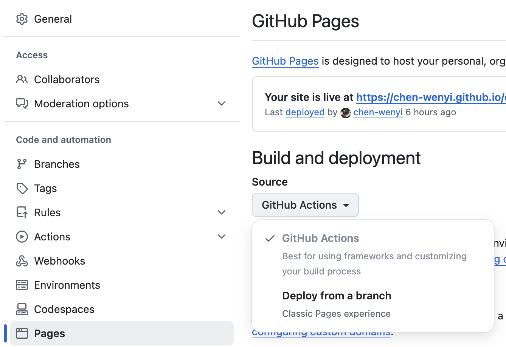

Docusaurus is a powerful tool for creating documentation websites, and hosting it on GitHub Pages is both straightforward and free. GitHub Pages allows you to host static sites, while GitHub Actions automates the CI/CD workflow. Here’s a step-by-step guide to set it up:

<!-- truncate -->

### Step 1: Create a Repository on GitHub

First, go to your GitHub account and create a new repository for your Docusaurus project.


### Step 2: scaffold a skeleton Docusaurus website

`npx create-docusaurus@latest my-website classic --typescript`

### Step 3: Update docusaurus.config.ts

To ensure your site works on GitHub Pages, update the url and baseUrl fields in the docusaurus.config.ts file:

```typescript
module.exports = {
  url: 'https://<your-username>.github.io',
  baseUrl: '/<repository-name>/',
};

```

### Step 4: Add the deploy.yml GitHub Action Workflow

Create a new file at `.github/workflows/deploy.yml` and add the following content. Refer to official website for the [latest yml configuration](https://docusaurus.io/docs/deployment#triggering-deployment-with-github-actions):

```yml title=".github/workflows/deploy.yml"
name: Deploy to GitHub Pages

on:
  push:
    branches:
      - main
    # Review gh actions docs if you want to further define triggers, paths, etc
    # https://docs.github.com/en/actions/using-workflows/workflow-syntax-for-github-actions#on

jobs:
  build:
    name: Build Docusaurus
    runs-on: ubuntu-latest
    steps:
      - uses: actions/checkout@v4
        with:
          fetch-depth: 0
      - uses: actions/setup-node@v4
        with:
          node-version: 18
          cache: npm

      - name: Install dependencies
        run: npm ci
      - name: Build website
        run: npm run build

      - name: Upload Build Artifact
        uses: actions/upload-pages-artifact@v3
        with:
          path: build

  deploy:
    name: Deploy to GitHub Pages
    needs: build

    # Grant GITHUB_TOKEN the permissions required to make a Pages deployment
    permissions:
      pages: write # to deploy to Pages
      id-token: write # to verify the deployment originates from an appropriate source

    # Deploy to the github-pages environment
    environment:
      name: github-pages
      url: ${{ steps.deployment.outputs.page_url }}

    runs-on: ubuntu-latest
    steps:
      - name: Deploy to GitHub Pages
        id: deployment
        uses: actions/deploy-pages@v4
```

### Step 5: Enable GitHub Actions

Go to the Settings tab of your repository, navigate to Actions, and enable workflows if they are not already enabled.


### Conclusion
Your Docusaurus site is now live on GitHub Pages! Visit `https://<your-username>.github.io/<repository-name>/` to see your site in action. With this setup, any changes pushed to the main branch will automatically update the site.