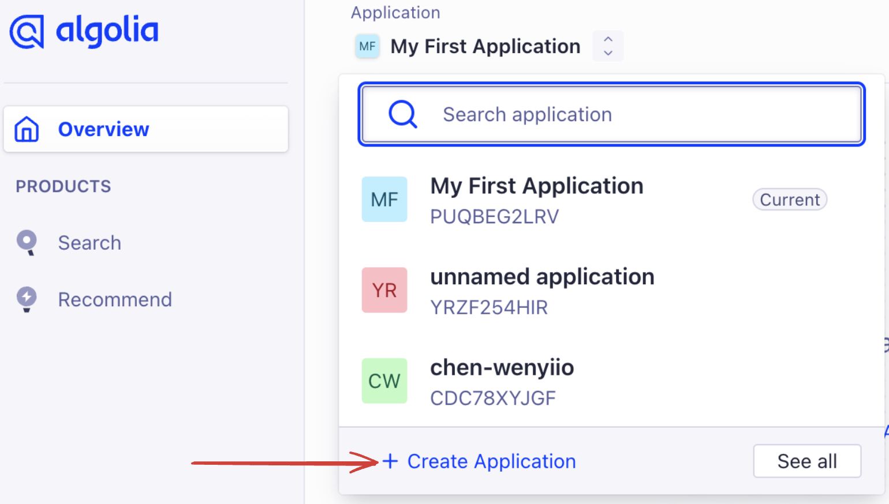
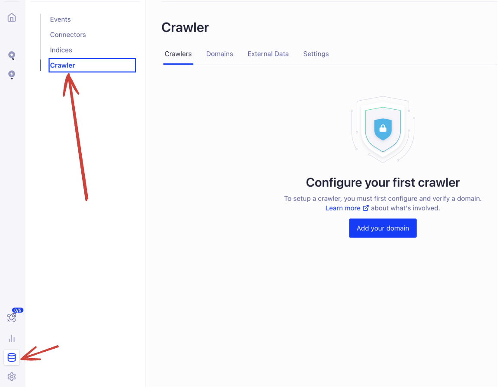
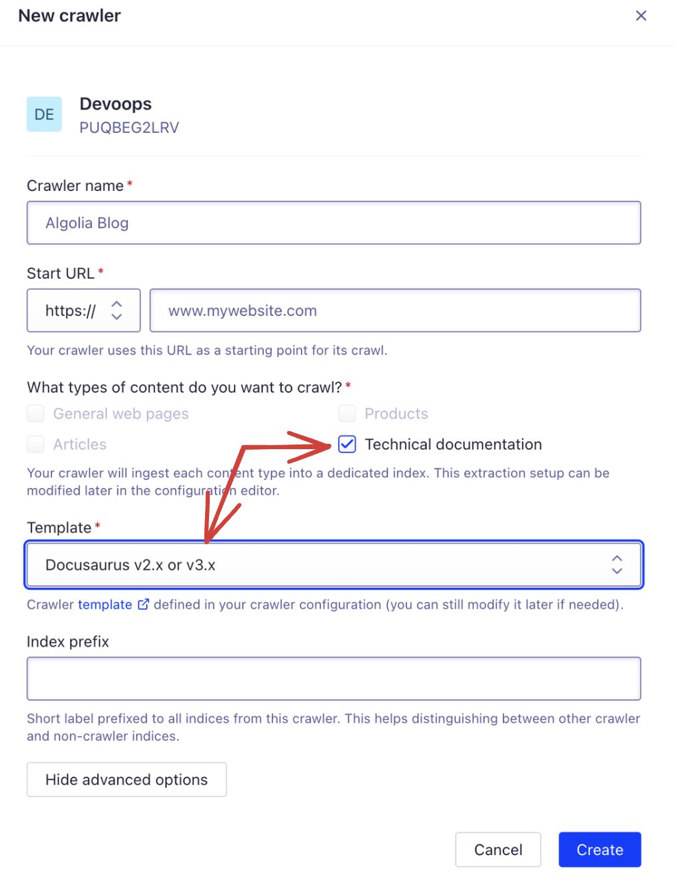
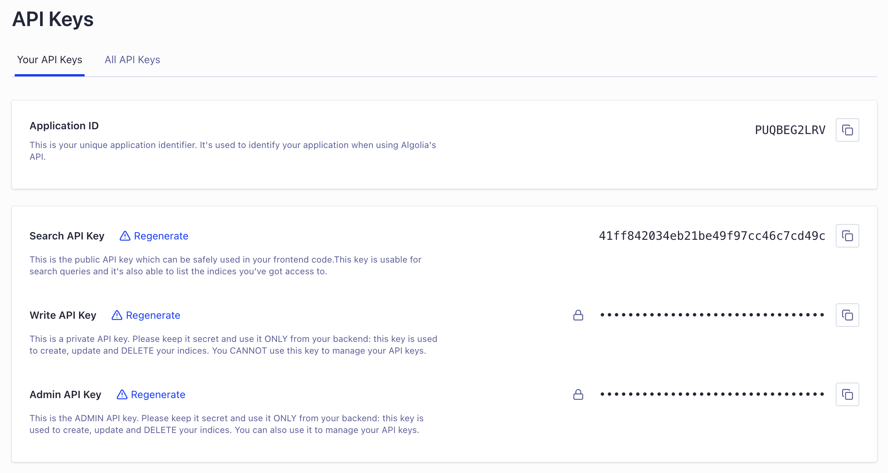
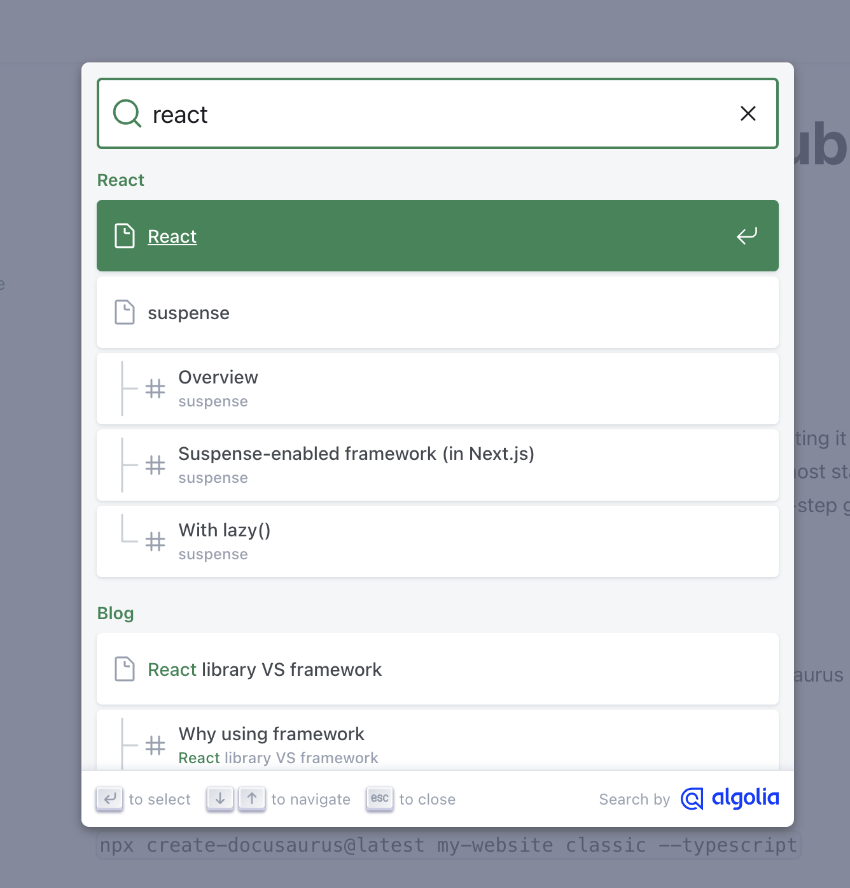
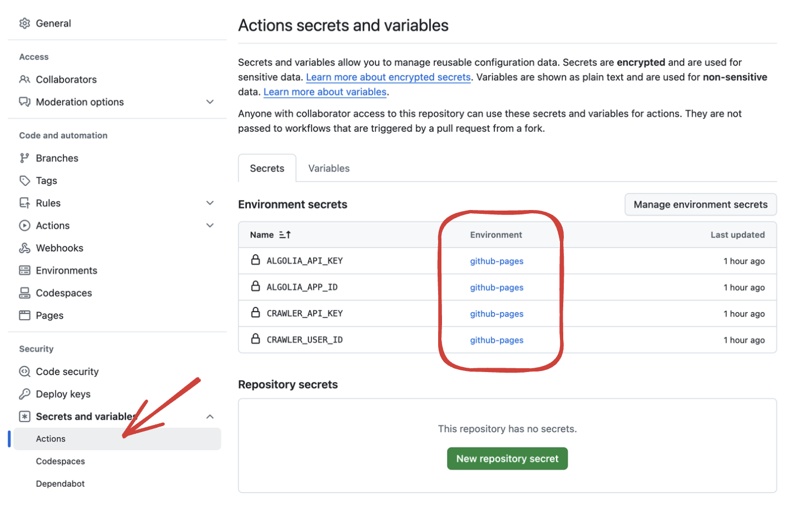
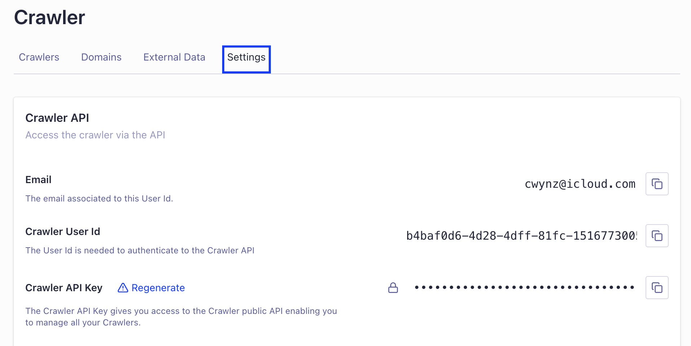
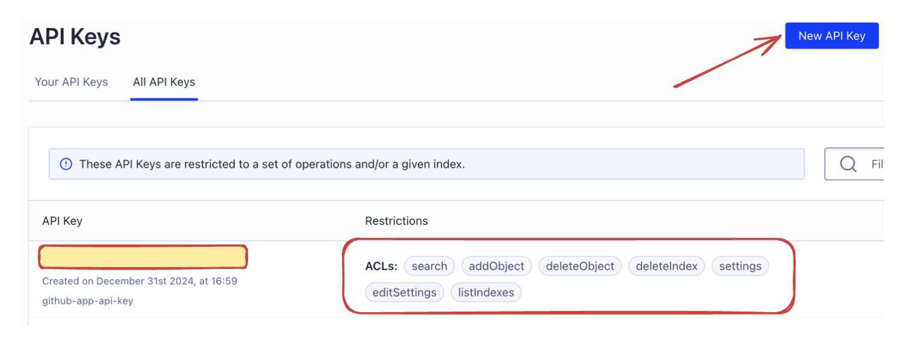

Docusaurus is a powerful tool for creating documentation websites, and hosting it on GitHub Pages is both straightforward and free. GitHub Pages allows you to host static sites, while GitHub Actions automates the CI/CD workflow. Here’s a step-by-step guide to set it up:

<!-- truncate -->

### Step 1: Create a Repository on GitHub

First, go to your GitHub account and create a new repository for your Docusaurus project.


### Step 2: scaffold a skeleton Docusaurus website

`npx create-docusaurus@latest my-website classic --typescript`

### Step 3: Update docusaurus.config.ts

To ensure your site works on GitHub Pages, update the url and baseUrl fields in the docusaurus.config.ts file:

```typescript
module.exports = {
  url: 'https://<your-username>.github.io',
  baseUrl: '/<repository-name>/',
};

```

### Step 4: Add the deploy.yml GitHub Action Workflow

Create a new file at `.github/workflows/deploy.yml` and add the following content. Refer to official website for the [latest yml configuration](https://docusaurus.io/docs/deployment#triggering-deployment-with-github-actions):

```yml title=".github/workflows/deploy.yml"
name: Deploy to GitHub Pages

on:
  push:
    branches:
      - main
    # Review gh actions docs if you want to further define triggers, paths, etc
    # https://docs.github.com/en/actions/using-workflows/workflow-syntax-for-github-actions#on

jobs:
  build:
    name: Build Docusaurus
    runs-on: ubuntu-latest
    steps:
      - uses: actions/checkout@v4
        with:
          fetch-depth: 0
      - uses: actions/setup-node@v4
        with:
          node-version: 18
          cache: npm

      - name: Install dependencies
        run: npm ci
      - name: Build website
        run: npm run build

      - name: Upload Build Artifact
        uses: actions/upload-pages-artifact@v3
        with:
          path: build

  deploy:
    name: Deploy to GitHub Pages
    needs: build

    # Grant GITHUB_TOKEN the permissions required to make a Pages deployment
    permissions:
      pages: write # to deploy to Pages
      id-token: write # to verify the deployment originates from an appropriate source

    # Deploy to the github-pages environment
    environment:
      name: github-pages
      url: ${{ steps.deployment.outputs.page_url }}

    runs-on: ubuntu-latest
    steps:
      - name: Deploy to GitHub Pages
        id: deployment
        uses: actions/deploy-pages@v4
```

### Step 5: Enable GitHub Actions

Go to the Settings tab of your repository, navigate to Actions, and enable workflows if they are not already enabled.


Your Docusaurus site is now live on GitHub Pages! Visit `https://<your-username>.github.io/<repository-name>/` to see your site in action. With this setup, any changes pushed to the main branch will automatically update the site.

## Update
### Implement Search on site

You need to enbale algolia crawler service for search. You can apply the service via [DocSearch program](https://docsearch.algolia.com/apply). But you don't have the full permission to manage the api keys (You may need the permissions for Github Action).

[official configuration](https://docusaurus.io/docs/search#using-algolia-docsearch)
```js title="docusaurus.config.js"
export default {
  // ...
  themeConfig: {
    // ...
    algolia: {
      // The application ID provided by Algolia
      appId: 'YOUR_APP_ID',

      // Public API key: it is safe to commit it
      apiKey: 'YOUR_SEARCH_API_KEY',

      indexName: 'YOUR_INDEX_NAME',

      // Optional: see doc section below
      contextualSearch: true,

      // Optional: Specify domains where the navigation should occur through window.location instead on history.push. Useful when our Algolia config crawls multiple documentation sites and we want to navigate with window.location.href to them.
      externalUrlRegex: 'external\\.com|domain\\.com',

      // Optional: Replace parts of the item URLs from Algolia. Useful when using the same search index for multiple deployments using a different baseUrl. You can use regexp or string in the `from` param. For example: localhost:3000 vs myCompany.com/docs
      replaceSearchResultPathname: {
        from: '/docs/', // or as RegExp: /\/docs\//
        to: '/',
      },

      // Optional: Algolia search parameters
      searchParameters: {},

      // Optional: path for search page that enabled by default (`false` to disable it)
      searchPagePath: 'search',

      // Optional: whether the insights feature is enabled or not on Docsearch (`false` by default)
      insights: false,

      //... other Algolia params
    },
  },
};
```

Below steps tell you how to setup a crawler on Algolia:

#### Step 1 Create an application


once the app is created, go to datasource page and crawler tab to set domian for crawling. Then add and verify the domain by instruction.



#### Step 2 Add a crawler



#### Step 3 Paste api keys

Find your apikeys and paste them in `docusaurus.config.ts`.



You can see the docSearch is functioning in your site.



### Github Action for recrawling

[algoliasearch-crawler-github-actions](https://github.com/algolia/algoliasearch-crawler-github-actions?tab=readme-ov-file) allows you to recreawling you site after each deployment. Add job below to `deploy.yml`.

```yml title=".github/workflows/deploy.yml"
  algolia_crawl:
      name: Algolia Recrawl
      needs: deploy
      runs-on: ubuntu-latest
      environment: github-pages
      steps:
        - name: Algolia crawler creation and crawl
          uses: algolia/algoliasearch-crawler-github-actions@v1.0.10
          id: algolia_crawler
          with: # mandatory parameters
            crawler-user-id: ${{ secrets.CRAWLER_USER_ID }}
            crawler-api-key: ${{ secrets.CRAWLER_API_KEY }}
            algolia-app-id: ${{ secrets.ALGOLIA_APP_ID }}
            algolia-api-key: ${{ secrets.ALGOLIA_API_KEY }}
            site-url: 'https://chen-wenyi.github.io/devoops/'
            crawler-name: 'devoops'
```

Create your secrets in repository settings.



You may find you crawler apikeys here:



For `ALGOLIA_API_KEY`, you have to create a new key (get error when using admin apikey) and grant proper permissions for it.



Now, push your code to remote and see if it is working!

