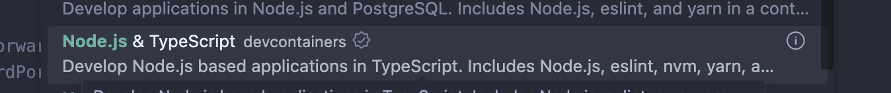

## Overview

> Dev Container lets you use a container as a full-featured development environment. 

I always remember when a new team member joins. We always give them the documentation on how to set up the 
development environment. Sometimes, the documentation is out of date and makes the setup a bit tricky, especially for newbies.
I’m not saying documentation is a waste of time. There’s definitely a better way to simplify setup and maintenance. It’s not just for new colleges, but for every team member when all the development environments are consistent across the team. 
That way, we can avoid those pesky “it works on my machine” problems.
{/* truncate */}

That's where dev containers come into play.

## How it works
Workspace files are **mounted** from the local file system or **copied** or **cloned** into the container. 
Extensions are installed and run inside the container, where they have full access to the tools, platform, and file system. 
This means that you can seamlessly switch your entire development environment just by connecting to a different container.


## Quick demo with frontend project

:::info
**prerequisite**:
- docker running on local/remote that you can connect to.
- vscode with extension: Dev Containers
:::

### Create an new project in Dev Container

1. Create an new container in vscode -> Dev Containers: New Dev Container.
2. Type Node.js and select:

3. Once the Dev Container is up, we can see a folder `.devcontainer `with an `devcontainer.json` file. It defines the 
development environment.
4. Creating new project via `pnpx create-next-app@latest`.
5. Now we can push the code to remote via Git.


#### Work with github
If you utilize a [Git credential manager(Github Cli)](https://docs.github.com/en/get-started/getting-started-with-git/caching-your-github-credentials-in-git#github-cli), your container should already have access to your credentials.
Alternatively, if you opt to share your SSH keys, please refer to [Sharing Git credentials](https://code.visualstudio.com/remote/advancedcontainers/sharing-git-credentials) with your container for further details.


### Integrate Dev Contaienr with exsisting project

It's even easier! You just need to exec `Dev Containers: Add Dev Container Configuration Files` in vscode. And Reopen project in Dev Container.

### Using own Dockerfile

```json title=".devcontainer/devcontainer.json"
{
	"name": "Dev Container Demo",
	// Or use a Dockerfile or Docker Compose file. More info: https://containers.dev/guide/dockerfile
	// "image": "mcr.microsoft.com/devcontainers/typescript-node:1-22-bookworm"
	"build": {
        // Path is relative to the devcontainer.json file.
        "dockerfile": "Dockerfile"
    }
	// Features to add to the dev container. More info: https://containers.dev/features.
	// "features": {},
	// Use 'forwardPorts' to make a list of ports inside the container available locally.
	// "forwardPorts": [],
	// Use 'postCreateCommand' to run commands after the container is created.
	// "postCreateCommand": "yarn install",
	// Configure tool-specific properties.
	// "customizations": {},
	// Uncomment to connect as root instead. More info: https://aka.ms/dev-containers-non-root.
	// "remoteUser": "root"
}
```

```text title=".devcontainer/Dockerfile"
FROM node:22
RUN npm i -g pnpm
```


