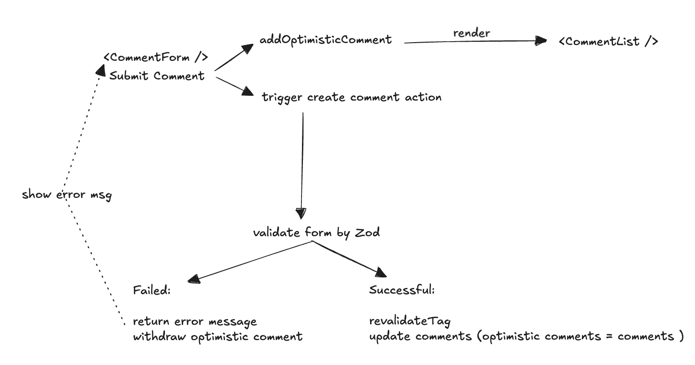

## Overview
In modern web development, creating seamless and responsive user experiences often involves handling real-time data updates and server-side interactions effectively. React 19 introduces two powerful hooks, useActionState and useOptimistic, designed to make these tasks more manageable. These hooks are particularly useful when implementing features like form validation with optimistic updates and server-side actions, especially in frameworks like Next.js.

{/* truncate */}

This blog will guide you through using **useActionState** and **useOptimistic** to build a robust form validation workflow. We’ll explore how to:
-	Implement Optimistic Updates: Allow users to see immediate feedback on their input while ensuring server-side consistency.
-	Validate Forms Seamlessly: Use client-side validations in sync with server-side validations for a smooth user experience.
-	Leverage Server Actions in Next.js: Integrate server-side logic to enhance validation and manage state effectively.

Whether you’re looking to improve user interactivity or streamline server communication, this tutorial will equip you with practical insights and code snippets to get started. By the end, you’ll have a fully functional example of a form that leverages React’s latest hooks and Next.js capabilities for an optimized and user-friendly experience.

## Basic Idea



## Implementation

The index page that fetch comments and pass to `<Comment />`

```tsx title="App.tsx"
import Comment from '@/components/comment';
import { Comment as IComment } from '@/typing';

export default async function Home() {
  const commentsResult = await fetch(
    `http://localhost:${process.env.PORT}/api/comment`,
    { next: { tags: ['comment'] }, cache: 'force-cache' }
  );

  const comments = (await commentsResult.json()) as IComment[];

  return (
    <div className='flex flex-col items-center justify-center mt-6'>
      <div className='flex flex-col  w-64'>
        <Comment comments={comments} />
      </div>
    </div>
  );
}
```

The `<Comments />` component that contains form and list.

```tsx title="Comments.tsx"
'use client';

import { createComment } from '@/app/actions';
import { Comment as IComment } from '@/typing';
import { useActionState, useOptimistic } from 'react';
import CommentForm from './commentForm';
import CommentList from './commentList';

export default function Comment({ comments }: { comments: IComment[] }) {
  const [state, formAction, pending] = useActionState(createComment, null);

  const [optimisticComments, addOptimisticComments] = useOptimistic(
    comments,
    (state, newComment: IComment) => {
      return [newComment, ...state];
    }
  );

  return (
    <div>
      <CommentForm
        state={state}
        formAction={formAction}
        pending={pending}
        addOptimisticComments={addOptimisticComments}
      />
      <CommentList comments={optimisticComments} />
    </div>
  );
}
```

`<CommentForm />` including the error message
```tsx title="CommentForm.tsx"
'use client';

import { Comment } from '@/typing';
import { FormEventHandler, startTransition } from 'react';
import { Button } from './ui/button';
import { Input } from './ui/input';
import { Label } from './ui/label';
import { Textarea } from './ui/textarea';

type State =
  | {
      errors: {
        name?: string[] | undefined;
        email?: string[] | undefined;
        message?: string[] | undefined;
      };
      values: {
        name: string;
        email: string;
        message: string;
      };
      success?: undefined;
    }
  | {
      success: true;
      errors?: undefined;
      values?: undefined;
    }
  | null;

export default function CommentForm({
  state,
  formAction,
  pending,
  addOptimisticComments,
}: {
  state: State;
  formAction: (payload: FormData) => void;
  pending: boolean;
  addOptimisticComments: (action: Comment) => void;
}) {
  const onSubmit: FormEventHandler<HTMLFormElement> = (e) => {
    const name = (e.target as any).name.value;
    const message = (e.target as any).message.value;
    startTransition(() => {
      addOptimisticComments({ name, message });
    });
  };
  return (
    <form action={formAction} onSubmit={onSubmit}>
      <div className='flex w-full flex-col gap-1.5'>
        <div>
          <Label htmlFor='name'>Name</Label>
          <Input
            type='text'
            id='name'
            name='name'
            defaultValue={state?.values?.name || ''}
            placeholder='Name'
            className={state?.errors?.name ? 'border-red-400' : ''}
          />
          {state?.errors?.name && (
            <p className='text-red-400 text-xs'>{state.errors.name[0]}</p>
          )}
        </div>
        <div>
          <Label htmlFor='email'>Email</Label>
          <Input
            type='email'
            id='email'
            name='email'
            defaultValue={state?.values?.email || ''}
            placeholder='Email'
            className={state?.errors?.email ? 'border-red-400' : ''}
          />
          {state?.errors?.email && (
            <p className='text-red-400 text-xs'>{state.errors.email[0]}</p>
          )}
        </div>
        <div>
          <Label htmlFor='message'>Your message</Label>
          <Textarea
            placeholder='Type your message here.'
            id='message'
            name='message'
            defaultValue={state?.values?.message || ''}
            className={state?.errors?.message ? 'border-red-400' : ''}
          />
          {state?.errors?.message && (
            <p className='text-red-400 text-xs'>{state.errors.message[0]}</p>
          )}
        </div>
        <Button disabled={pending}>Submit</Button>
      </div>
    </form>
  );
}
```

```tsx title="action.ts"
'use server';

import { revalidateTag } from 'next/cache';
import { z } from 'zod';

const commentSchema = z.object({
  name: z.string().min(5).max(100),
  email: z.string().email(),
  message: z.string().min(5).max(100),
});

export async function createComment(
  previousState: unknown,
  formData: FormData
) {
  const name = formData.get('name') as string;
  const email = formData.get('email') as string;
  const message = formData.get('message') as string;

  const formValues = {
    name,
    email,
    message,
  };

  const { success, error, data } = commentSchema.safeParse(formValues);
  if (!success) {
    return {
      errors: error.flatten().fieldErrors,
      values: formValues,
    };
  }

  await fetch(`http://localhost:${process.env.PORT}/api/comment/`, {
    method: 'POST',
    headers: {
      'Content-Type': 'application/json',
    },
    body: JSON.stringify({ name: data.name, message: data.message }),
  });
  
  revalidateTag('comment');

  return {
    success,
  };
}
```

## Conclusion
With React 19’s useActionState and useOptimistic hooks, building a form with seamless validation and responsive updates has never been easier. By combining client-side and server-side capabilities, you can create a user experience that feels instantaneous while maintaining data integrity. 