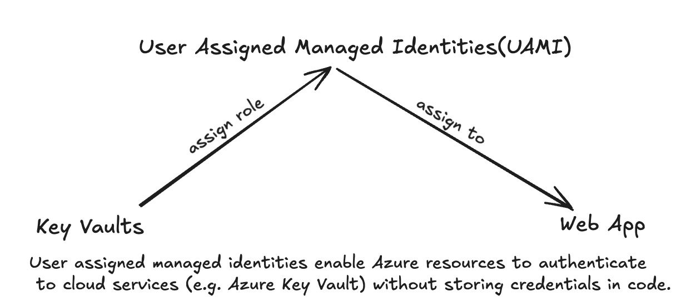

## Overview
In this guide, we’ll walk through the steps to connect an Azure Web App to Azure Key Vault securely using Managed Identities. This setup ensures seamless integration without the need to store sensitive credentials in your application code.

{/* truncate */}




### 1. Create Your Azure Key Vault

Start by creating a Key Vault in the Azure portal:
- Navigate to **Key Vaults** and select + Create.
- Provide the required details such as Subscription, Resource Group, Region, and a Name for your Key Vault.
- Once completed, your Key Vault will be ready to store secrets, keys, and certificates.

### 2. Grant Yourself Access to the Key Vault

Even if you’re the owner of the subscription, you need explicit permissions to access the Key Vault. To do this:
- Go to the **Access control (IAM) **section of the Key Vault.
- Select + **Add role assignment**.
- Choose the **Key Vault Administrator** or **Key Vault Secrets User** role and assign it to yourself.

This step ensures you can manage secrets and other Key Vault resources.

### 3. Enable Managed Identities for Your Web App

A Managed Identity acts as a secure bridge between your Azure Web App and the Key Vault. Here’s how to enable it:
-	Go to your **Azure Web App** in the portal.
- Navigate to **Settings > Identity**.
-	Under the **User Assigned** tab, select + Add and link the Managed Identity you want to use.

This identity will later be granted permissions to access the Key Vault.

### 4. Assign Key Vault Permissions to the Managed Identity Using IAM

With the Managed Identity created, the next step is to grant it access to your Key Vault through Azure IAM:
- Navigate to your **Key Vault** in the Azure portal.
- Select **Access Control (IAM)** from the left-hand menu.
- Click + Add role assignment.
- In the Role dropdown, select a role like **Key Vault Secrets User** or **Key Vault Contributor**, depending on the level of access required.
- In the Assign access to field, select **Managed Identity**.
- Under Members, choose the **Managed Identity** linked to your Web App.
- Save the role assignment.

By granting permissions through IAM, your Managed Identity now has the required access to interact with the Key Vault securely.

### Integrate the Managed Identity in Your Web App

#### Option 1 - using `DefaultAzureCredential` with Environment Variable

you need to specify `AZURE_CLIENT_ID` in your Web App Environment Variables. refer to [official doc](https://learn.microsoft.com/en-us/java/api/com.azure.identity.environmentcredential?view=azure-java-stable).
`AZURE_CLIENT_ID` is the client ID of your **managed identity**.

```ts
using Azure.Identity;
using Azure.Security.KeyVault.Secrets;

var keyVaultClient = new SecretClient(
  new Uri(keyVaultUri), new DefaultAzureCredential());
var secret = await keyVaultClient.GetSecretAsync(secretName);
var apiKey = secret.Value.Value;
```

#### Option 2 - using `DefaultAzureCredential`
```ts
using Azure.Identity;
using Azure.Security.KeyVault.Secrets;

var keyVaultClient = new SecretClient(
  new Uri(keyVaultUri), new DefaultAzureCredential(
    new DefaultAzureCredentialOptions
    {
        ManagedIdentityClientId = "<your managed identity client ID>"
    }));
var secret = await keyVaultClient.GetSecretAsync(secretName);
var apiKey = secret.Value.Value;
```


[Ref: How to use managed identities for App Service and Azure Functions](https://learn.microsoft.com/en-us/azure/app-service/overview-managed-identity?tabs=portal%2Cdotnet)
