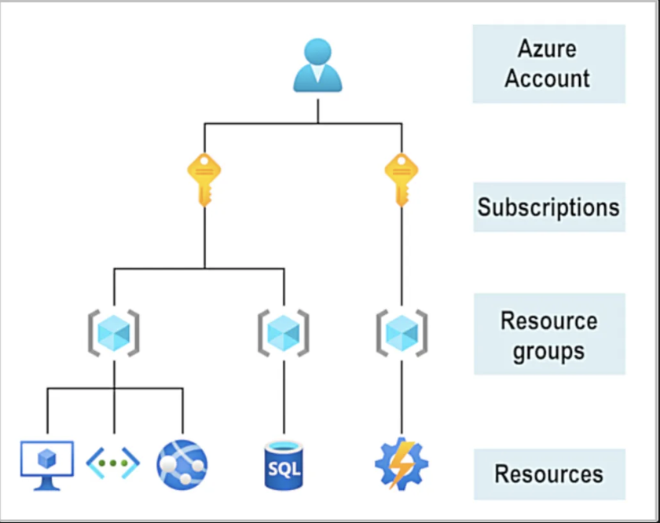

# Fundamentals

## What is Azure?
A **cloud computing platform** with cloud-based services.

**Cloud computing:** delivery of computing services over the internet.

## Shared Responsibility Model
Responsibilities get shared between the *cloud provider* and the *consumer*.

## Three Cloud Models
private, public, hybrid

## Multi-cloud
use multiple public cloud providers. Maybe you use different features from different cloud providers. Or maybe you started your cloud journey with one provider and are in the process of migrating to a different provider. Regardless, in a multi-cloud environment you deal with two (or more) public cloud providers and manage resources and security in both environments.

## Azure Arc
Azure Arc is a set of technologies that helps manage your cloud environment. Azure Arc can help manage your cloud environment, whether it's a public cloud solely on Azure, a private cloud in your datacenter, a hybrid configuration, or even a multi-cloud environment running on multiple cloud providers at once.

## High availability(uptime)
When you’re deploying an application, a service, or any IT resources, it’s important the resources are available when needed. High availability focuses on ensuring maximum availability, regardless of disruptions or events that may occur.

When you’re architecting your solution, you’ll need to account for service availability guarantees. Azure is a highly available cloud environment with uptime guarantees depending on the service. These guarantees are part of the service-level agreements (SLAs).

## Scalability
Scalability refers to the ability to adjust resources to meet demand.

### Vertical scaling
With vertical scaling, if you were developing an app and you needed more processing power, you could vertically scale up to add more CPUs or RAM to the virtual machine. Conversely, if you realized you had over-specified the needs, you could vertically scale down by lowering the CPU or RAM specifications.

### Horizontal scaling
With horizontal scaling, if you suddenly experienced a steep jump in demand, your deployed resources could be scaled out (either automatically or manually). For example, you could add additional virtual machines or containers, scaling out. In the same manner, if there was a significant drop in demand, deployed resources could be scaled in (either automatically or manually), scaling in.

## Predictability
Predictability in the cloud lets you move forward with confidence. Predictability can be focused on performance predictability or cost predictability. 

## Service Types
### Infrastructure as a Service(IaaS)
Infrastructure as a service (IaaS) is the most flexible category of cloud services, as it provides you the maximum amount of control for your cloud resources. In an IaaS model, the cloud provider is responsible for maintaining the hardware, network connectivity (to the internet), and physical security. You’re responsible for everything else: operating system installation, configuration, and maintenance; network configuration; database and storage configuration; and so on. With IaaS, you’re essentially renting the hardware in a cloud datacenter, but what you do with that hardware is up to you.

#### Scenarios:
- Lift-and-shift migration: You’re setting up cloud resources similar to your on-prem datacenter, and then simply moving the things running on-prem to running on the IaaS infrastructure.
- Testing and development: You have established configurations for development and test environments that you need to rapidly replicate. You can start up or shut down the different environments rapidly with an IaaS structure, while maintaining complete control.

### Platform as a Service(PaaS)
Platform as a service (PaaS) is a middle ground between renting space in a datacenter (infrastructure as a service) and paying for a complete and deployed solution (software as a service). In a PaaS environment, the cloud provider maintains the physical infrastructure, physical security, and connection to the internet. They also maintain the operating systems, middleware, development tools, and business intelligence services that make up a cloud solution. In a PaaS scenario, you don't have to worry about the licensing or patching for operating systems and databases.

PaaS is well suited to provide a complete development environment without the headache of maintaining all the development infrastructure.

#### Scenarios:
- Web applications: You’re developing a web application and you want to focus on the application, not the infrastructure.

### Software as a Service(SaaS)
Software as a service (SaaS) is the most complete cloud service model from a product perspective. With SaaS, you’re essentially renting or using a fully developed application. Email, financial software, messaging applications, and connectivity software are all common examples of a SaaS implementation.

While the SaaS model may be the least flexible, it’s also the easiest to get up and running. It requires the least amount of technical knowledge or expertise to fully employ.

#### Scenarios:
- Email: You’re a small business and you don’t want to manage your own email servers. You can use a SaaS email provider to manage your email.
- Collaboration: You’re a small business and you want to use a collaboration tool to help your team work together. You can use a SaaS collaboration tool to help your team work together.

## Azure Account

## Azure physical infrastructure

### Physical infrastructure
As a global cloud provider, Azure has datacenters around the world. However, these individual datacenters aren’t directly accessible. Datacenters are grouped into Azure Regions or Azure Availability Zones that are designed to help you achieve resiliency and reliability for your business-critical workloads.

### Regions
A region is a geographical area on the planet that contains at least one, but potentially multiple datacenters that are nearby and networked together with a low-latency network. Azure intelligently assigns and controls the resources within each region to ensure workloads are appropriately balanced.

### Availability Zones
Availability zones are physically separate datacenters within an Azure region.

