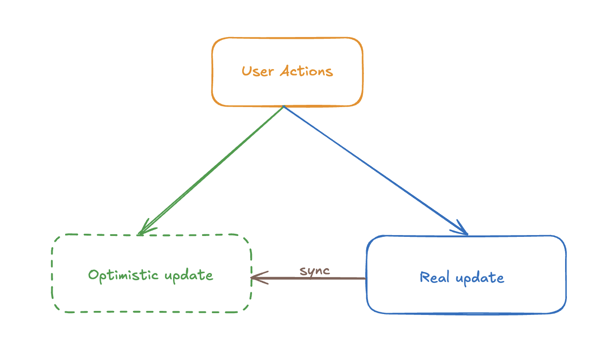

# useOptimistic
## Definition
useOptimistic is a React Hook that lets you **optimistically** update the UI.



```jsx
const [optimisticState, addOptimistic] = useOptimistic(state, updateFn);
```

## Usage
:::warning
An optimistic state update should be occurred inside a transition(wrap with startTransition) or action. 
:::
```jsx
import { useOptimistic } from "react";
import { useTransition } from "react";
import { useState } from "react";

export default function App() {
  const [isPending, startTransition] = useTransition();
  const [val, setVal] = useState("");

  const [messages, setMessages] = useState([]);
  const [optimisticMsgs, updateOptimisticMsgs] = useOptimistic(
    messages,
    (state, msg) => {
      return [...state, msg];
    }
  );

  const send = () => {
    setVal("");
    startTransition(async () => {
      updateOptimisticMsgs(val); // optimistically update the UI
      const { messages } = await sendMessage(val);
      startTransition(() => {
        setMessages(messages); // update the real data
      });
    });
  };

  return (
    <div className="App">
      <input value={val} onChange={({ target }) => setVal(target.value)} />
      <button onClick={send}>send</button>
      {optimisticMsgs.map((m) => (
        <div>{m}</div>
      ))}
      {isPending && <div>sending...</div>}
    </div>
  );
}

const messages = [];
const sendMessage = async (message) => {
  await awaitSomeTime(2000);
  messages.push(message);
  return {
    success: true,
    messages,
  };
};

const awaitSomeTime = async (timeout) => {
  await new Promise((resolve) => {
    setTimeout(() => {
      resolve(null);
    }, timeout);
  });
};

```
[codesandbox demo](https://codesandbox.io/p/sandbox/3jcwsf)
