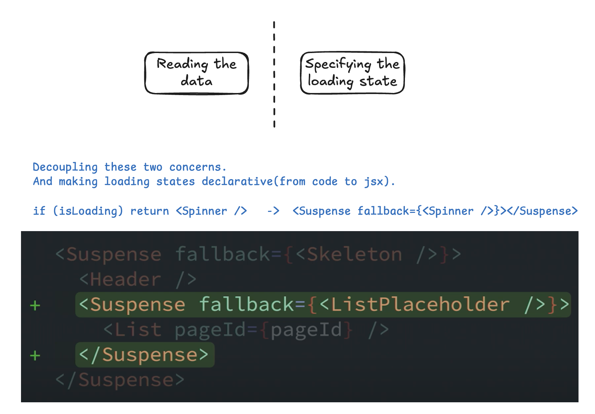

import Tabs from '@theme/Tabs';
import TabItem from '@theme/TabItem';

## Overview

Reference: [`<Suspence>`](https://react.dev/reference/react/Suspense#suspense)

`<Suspense>` lets you display a fallback until its children have finished loading.

```jsx
<Suspense fallback={<Loading />}>
  <SomeComponent />
</Suspense>
```

:::warning
Only Suspense-enabled data sources will activate the Suspense component. They include:

- Data fetching with **Suspense-enabled** frameworks like Relay and Next.js
- Lazy-loading component code with **lazy**
- Reading the value of a **cached Promise** with **use**
:::

### Why suspense?



## Suspense-enabled framework (in Next.js)

<Tabs>
  <TabItem value="page" label="page.tsx" default>
  ```tsx
  import Albums from "@/components/Albums";
  import Loading from "@/components/Loading";
  import { Suspense } from "react";

  export default function Home() {
    return (
      <main>
        <Suspense fallback={<Loading />}>
          <Albums />
        </Suspense>
      </main>
    );
  }
  ```
  </TabItem>
  <TabItem value="Albums" label="Albums.tsx">
    ```tsx
    import { getAlbums } from "@/api";
    // server component
    export default async function Albums() {
      const albums = await getAlbums();
      return (
        <ul>
          {albums.map((album) => (
            <li key={album}>{album}</li>
          ))}
        </ul>
      );
    }
    ```
  </TabItem>
  <TabItem value="api" label="api.ts">
  ```ts
  export const getAlbums = async () => {
    await new Promise((resolve) => {
      setTimeout(() => {
        resolve(null);
      }, 2000);
    });

    const res = [
      "Eternal Whispers",
      "Golden Horizons",
      "Mystic Dreams",
      "Wandering Echoes",
      "Bright Shadows",
      "Forgotten Tides",
      "Lonely Legends",
      "Silent Memories",
      "Dreamy Skies",
      "Lost Visions",
    ];
    return res
  };
  ```
  </TabItem>
</Tabs>
[**Full example in CodeSandbox**](https://codesandbox.io/p/sandbox/react19-suspense-demo-s3cmwv)

## With lazy()

<Tabs>
  <TabItem value="page" label="page.tsx" default>
    ```tsx
    import { Suspense, lazy } from "react";
    import Loading from "./Loading";
    import "./styles.css";

    const Albums3 = lazy(() => delayForDemo(import("./Albums3.js")));

    export default function App() {
      const albums = getAlbums();
      return (
        <div className="App">
          <h1>Albums by lazy</h1>
          <Suspense fallback={<Loading />}>
            <Albums3 albums={albums} />
          </Suspense>
        </div>
      );
    }

    // Add a fixed delay so you can see the loading state
    function delayForDemo(promise) {
      return new Promise((resolve) => {
        setTimeout(resolve, 5000);
      }).then(() => promise);
    }
    ```
  </TabItem>
  <TabItem value="Albums" label="Albums.tsx">
    ```tsx
      export default function Albums3() {
        const albums = [
          "Eternal Whispers",
          "Golden Horizons",
          "Mystic Dreams",
          "Wandering Echoes",
          "Bright Shadows",
          "Forgotten Tides",
          "Lonely Legends",
          "Silent Memories",
          "Dreamy Skies",
          "Lost Visions",
        ];
        return (
          <ul>
            {albums.map((album) => (
              <li>{album}</li>
            ))}
          </ul>
        );
    }
    ```
  </TabItem>
</Tabs>
[**Full example in CodeSandbox**](https://codesandbox.io/p/sandbox/react19-suspense-demo-s3cmwv)


## Cached Promise with use
There are two ways to adopt `use` api:
### Option 1: use cached promise

:::info
Since [use](https://react.dev/reference/react/use) is an api rather than hook. That's the reason we need a cached promise to avoid recreating a promise on each render. 
:::

<Tabs>
  <TabItem value="app" label="app.jsx" default>
    ```jsx
    import { Suspense } from "react";
    import Albums from "./Albums";
    import Loading from "./Loading";
    import "./styles.css";

    export default function App() {
      return (
        <div className="App">
          <h1>Albums by cached promise</h1>
          <Suspense fallback={<Loading />}>
            <Albums />
          </Suspense>
        </div>
      );
    }
    ```
  </TabItem>
  <TabItem value="Albums" label="Albums.js">
    ```jsx
    import { use } from "react";
    import { cached_getAlbums } from "./api";

    export default function Albums() {
      const albums = use(cached_getAlbums());
      return (
        <ul>
          {albums.map((album) => (
            <li>{album}</li>
          ))}
        </ul>
      );
    }
    ```
  </TabItem>
  <TabItem value="api" label="api.js">
    ```jsx
    const cache = new Map();

    export const cached_getAlbums = () => {
      if (!cache.get("getAlbums")) {
        cache.set("getAlbums", getAlbums());
      }

      return cache.get("getAlbums");
    };

    export const getAlbums = async () => {
      await new Promise((resolve) => {
        setTimeout(() => {
          resolve();
        }, 2000);
      });

      return (res = [
        "Eternal Whispers",
        "Golden Horizons",
        "Mystic Dreams",
        "Wandering Echoes",
        "Bright Shadows",
        "Forgotten Tides",
        "Lonely Legends",
        "Silent Memories",
        "Dreamy Skies",
        "Lost Visions",
      ]);
    };
    ```
  </TabItem>
</Tabs>

### Option 2: use promise as props

<Tabs>
  <TabItem value="app" label="app.jsx" default>
  ```jsx
  import { Suspense } from "react";
  import Albums2 from "./Albums2";
  import { getAlbums } from "./api";
  import Loading from "./Loading";
  import "./styles.css";

  export default function App() {
    const albums = getAlbums(); // do not await here
    return (
      <div className="App">
        <h1>Albums by promise as props</h1>
        <Suspense fallback={<Loading />}>
          <Albums2 albums={albums} />
        </Suspense>
      </div>
    );
  }
  ```
  </TabItem>
  <TabItem value="Albums2" label="Albums2.js">
    ```jsx
  import { use } from "react";

  export default function Albums2({ albums }) { // albums: Promise
    const _albums = use(albums);
    return (
      <ul>
        {_albums.map((album) => (
          <li>{album}</li>
        ))}
      </ul>
    );
  }
  ```
  </TabItem>
  <TabItem value="api" label="api.js">
  ```jsx
  export const getAlbums = async () => {
    await new Promise((resolve) => {
      setTimeout(() => {
        resolve();
      }, 2000);
    });

    return (res = [
      "Eternal Whispers",
      "Golden Horizons",
      "Mystic Dreams",
      "Wandering Echoes",
      "Bright Shadows",
      "Forgotten Tides",
      "Lonely Legends",
      "Silent Memories",
      "Dreamy Skies",
      "Lost Visions",
    ]);
  };
  ```
  </TabItem>
</Tabs>

[**Full example in CodeSandbox**](https://codesandbox.io/p/sandbox/react19-suspense-demo-s3cmwv)


